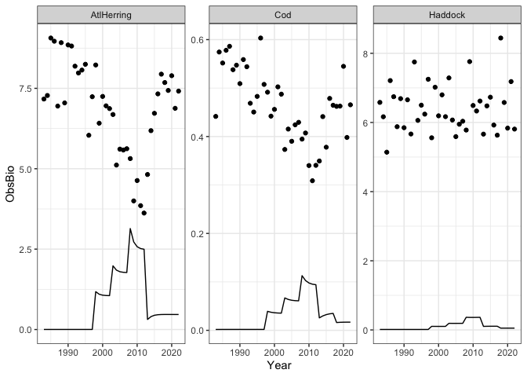
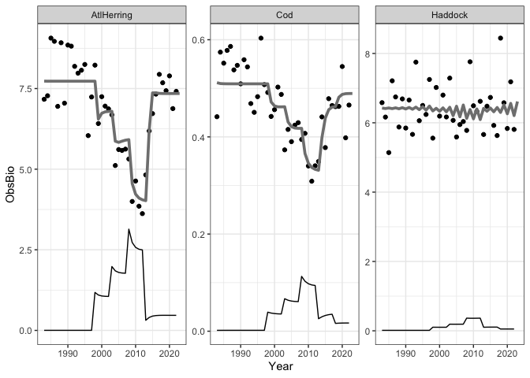

MultispeciesMSE
================
Sarah Gaichas
1/11/2022

Steps for multispecies MSE:

# Condition operating model on data

## Data

Simulated output of ecosystem model. Options include Norwegian-Barents
Atlantis generated dataset in
[`mskeyrun`](https://noaa-edab.github.io/ms-keyrun/) R package and
generating data from the [Georges Bank Rpath
model](https://github.com/NOAA-EDAB/GBRpath).

### mskeyrun (NOBA Atlantis) data

Which species to use in the model? Probably the ones that interact the
most. Here we use simulated survey diet composition to find the highest
average diet proportions between the 11 species in the simulated
dataset. We are assuming we only want to focus on managed fish species,
rather than interactions with lower trophic levels or protected species.

``` r
# install data package if needed
#remotes::install_github("NOAA-EDAB/ms-keyrun")
# the libraries are all in the first code chunk above now
#library(mskeyrun)

# which species pairs interact the most? 
# a too-quick analysis finding the mean proportion in diet from the diet dataset:

predprey <- mskeyrun::simSurveyDietcomp %>%
  filter(prey %in% unique(Name)) %>%
  select(Name, agecl, year, prey, value) %>%
  group_by(Name, prey) %>%
  summarise(avgpreyprop = mean(value)) %>%
  unite('Pred-Prey', Name:prey, sep = "-")
```

    ## `summarise()` has grouped output by 'Name'. You can override using the `.groups` argument.

``` r
predprey %>% arrange(desc(avgpreyprop))
```

    ## # A tibble: 34 x 2
    ##    `Pred-Prey`                  avgpreyprop
    ##    <chr>                              <dbl>
    ##  1 Redfish-Blue_whiting              0.468 
    ##  2 North_atl_cod-Capelin             0.133 
    ##  3 North_atl_cod-Haddock             0.0921
    ##  4 Redfish-Haddock                   0.0824
    ##  5 Blue_whiting-Redfish              0.0414
    ##  6 North_atl_cod-Long_rough_dab      0.0332
    ##  7 Haddock-Long_rough_dab            0.0243
    ##  8 Green_halibut-Redfish             0.0210
    ##  9 Haddock-Norwegian_ssh             0.0193
    ## 10 Haddock-North_atl_cod             0.0168
    ## # … with 24 more rows

Select species from the mskeyrun dataset and get survey biomass and
catch data for fitting. For now, pull Redfish and Blue\_whiting. Later
could add North\_atl\_cod, Capelin, Haddock as possibilities.

``` r
index.df <- mskeyrun::simSurveyIndex %>% filter(Name %in% c("Redfish", "Blue_whiting"))
harvest.df <- mskeyrun::simCatchIndex %>% filter(Name %in% c("Redfish", "Blue_whiting"))

data.years <- unique(mskeyrun::simSurveyIndex$year)
```

Plot them

``` r
# plot(data.years,index, pch=19,xlab="Year",ylab="Million tonnes (B or C)",
#      ylim=c(0,1200))
# lines(data.years,harvest,lty=2,lwd=2)

index.df %>%
  filter(variable=="biomass") %>%
  ggplot() +
  geom_point(aes(x=year, y=value, colour=survey)) +
  geom_line(data=(harvest.df %>% filter(variable=="catch")), 
            aes(x=year, y=value)) +
  theme_bw() +
  facet_wrap(~Name)
```

<!-- -->

Do we want to use just one of the surveys if we use this dataset? Maybe
fall because Blue whiting migrate from the system in the spring (though
maybe that is when Redfish eat them all? might be worth a look)

### Rpath data

Full dataset now in the `data` folder in this repo.

``` r
#load Rpath Georges Bank model outputs, object is called GB.data
load(here("multispecies/data/GBdata.rda"))

#units are tons/square kilometer for biomass and catch
str(GB.data)
```

    ## Classes 'data.table' and 'data.frame':   120 obs. of  5 variables:
    ##  $ Year    : int  1983 1984 1985 1986 1987 1988 1989 1990 1991 1992 ...
    ##  $ Species : chr  "Cod" "Cod" "Cod" "Cod" ...
    ##  $ ObsBio  : num  0.34 0.47 0.649 0.374 0.866 ...
    ##  $ TotCatch: num  0.00181 0.00184 0.00186 0.00187 0.00187 ...
    ##  $ Fmort   : num  0.00532 0.00392 0.00286 0.00499 0.00216 ...
    ##  - attr(*, ".internal.selfref")=<externalptr>

``` r
#there are three spexxies
unique(GB.data$Species)
```

    ## [1] "Cod"        "Haddock"    "AtlHerring"

``` r
data.years <- unique(GB.data$Year)

GB.data %>%
  ggplot()+
  geom_point(aes(x=Year, y=ObsBio)) +
  geom_line(aes(x=Year, y=TotCatch)) +
  theme_bw() +
  facet_wrap(~Species)
```

<!-- -->

## Multispecies operating model

Production model or biomass-dynamics model form with species interaction
terms. Use Gavin’s `schaefer` function as modified below and reuse as
many other functions as possible.

What interactions to model?

  - Predation mortality
  - Prey impacts on growth?

### Schaefer model (single species, directly from [my-first-mse](https://github.com/gavinfay/cinar-mse/blob/main/materials/exercises/day-01/my-first-mse.Rmd))

First, the logistic production function:

``` r
schaefer <- function(B,C,K,r) {
  #function schaefer takes the current biomass, a catch, 
  #and the model parameters to compute next year's biomass
  res <- B + B * r * (1 - B/K) - C
  return(max(0.001,res))  # we add a constraint to prevent negative biomass
}
```

Now a function to do the biomass projection:

``` r
dynamics <- function(pars,C,yrs) {
  # dynamics takes the model parameters, the time series of catch, 
  # & the yrs to do the projection over
  
  # first extract the parameters from the pars vector (we estimate K in log-space)
  K <- exp(pars[1])
  r <- exp(pars[2])
  
  # find the total number of years
  nyr <- length(C) + 1
  
  # if the vector of years was not supplied we create 
  # a default to stop the program crashing
  if (missing(yrs)) yrs <- 1:nyr
  
  #set up the biomass vector
  B <- numeric(nyr)
  
  #intialize biomass at carrying capacity
  B[1] <- K
  # project the model forward using the schaefer model
  for (y in 2:nyr) {
    B[y] <- schaefer(B[y-1],C[y-1],K,r)
  }
  
  #return the time series of biomass
  return(B[yrs])
  
  #end function dynamics
}  
```

We are going to condition the operating model by estimating the
parameters based on the historical biomass index data.

To do this we make a function that shows how well the current parameters
fit the data, we assume that the observation errors around the true
biomass are log-normally distributed.

``` r
# function to calculate the negative log-likelihood
nll <- function(pars,C,U) {  #this function takes the parameters, the catches, and the index data
  sigma <- exp(pars[3])  # additional parameter, the standard deviation of the observation error
  B <- dynamics(pars,C)  #run the biomass dynamics for this set of parameters
  Uhat <- B   #calculate the predicted biomass index - here we assume an unbiased absolute biomass estimate
  output <- -sum(dnorm(log(U),log(Uhat),sigma,log=TRUE),na.rm=TRUE)   #calculate the negative log-likelihood
  return(output)
  #end function nll
}
```

Function to perform the assessment and estimate the operating model
parameters  
(i.e. to fit the logistic model to abundance data)

``` r
assess <- function(catch,index,calc.vcov=FALSE,pars.init) {
  # assess takes catch and index data, initial values for the parameters,
  # and a flag saying whether to compute uncertainty estimates for the model parameters
  
  #fit model
  # optim runs the function nll() repeatedly with differnt values for the parameters,
  # to find the values that give the best fit to the index data
  res <- optim(pars.init,nll,C=catch,U=index,hessian=TRUE)
  
  # store the output from the model fit
  output <- list()
  output$pars <- res$par
  output$biomass <- dynamics(res$par,catch)
  output$convergence <- res$convergence
  output$nll <- res$value
  if (calc.vcov)
    output$vcov <- solve(res$hessian)
  
  return(output)
  #end function assess
}
```

## Conditioning

### Single species models?

Try fitting to each species separately first, adjusting Gavin’s code
(test with atlantis output till we get rpath):

Make separate data objects for each species

``` r
harvest.redfish <- harvest.df %>%
  filter(Name=="Redfish",
         variable=="catch") %>%
  select(value) %>%
  unlist() %>%
  unname()

index.redfish <- index.df %>%
  filter(Name=="Redfish",
         variable=="biomass", 
         survey=="BTS_fall_allbox_effic1") %>%
  select(value) %>%
  unlist() %>%
  unname()

harvest.bluewhiting <- harvest.df %>%
  filter(Name=="Blue_whiting",
         variable=="catch") %>%
  select(value) %>%
  unlist() %>%
  unname()

index.bluewhiting <- index.df %>%
  filter(Name=="Blue_whiting",
         variable=="biomass", 
         survey=="BTS_fall_allbox_effic1") %>%
  select(value) %>%
  unlist() %>%
  unname()

harvest.GBcod <- GB.data %>%
  filter(Species=="Cod") %>%
  select(TotCatch) %>%
  unlist() %>%
  unname()

index.GBcod <- GB.data %>%
  filter(Species=="Cod") %>%
  select(ObsBio) %>%
  unlist() %>%
  unname()

harvest.GBherring <- GB.data %>%
  filter(Species=="AtlHerring") %>%
  select(TotCatch) %>%
  unlist() %>%
  unname()

index.GBherring <- GB.data %>%
  filter(Species=="AtlHerring") %>%
  select(ObsBio) %>%
  unlist() %>%
  unname()

harvest.GBhaddock <- GB.data %>%
  filter(Species=="Haddock") %>%
  select(TotCatch) %>%
  unlist() %>%
  unname()

index.GBhaddock <- GB.data %>%
  filter(Species=="Haddock") %>%
  select(ObsBio) %>%
  unlist() %>%
  unname()  
```

First define initial parameter vector for each species: log(K), log(r),
log(sigma)

``` r
#ini.parms <- c(log(1200), log(0.1), log(0.3))

# use max survey B as the initial value for K
maxsvB.red <- max(index.redfish)
ini.parms.red <- c(log(maxsvB.red), log(0.1), log(0.3))

maxsvB.blue <- max(index.bluewhiting)
ini.parms.blue <- c(log(maxsvB.blue), log(0.5), log(0.3))

maxsvB.GBcod <- max(index.GBcod)
ini.parms.GBcod <- c(log(maxsvB.GBcod), log(0.2), log(0.3))

maxsvB.GBherring <- max(index.GBherring)
ini.parms.GBherring <- c(log(maxsvB.GBherring), log(0.3), log(0.3))

maxsvB.GBhaddock <- max(index.GBhaddock)
ini.parms.GBhaddock <- c(log(maxsvB.GBhaddock), log(0.3), log(0.3))
```

Fit the logistic model to data (redfish):

``` r
redfish <- assess(harvest.redfish,index.redfish,calc.vcov=TRUE,ini.parms.red)
redfish
```

    ## $pars
    ## [1] 14.7332517 -0.5727151 -2.1959659
    ## 
    ## $biomass
    ##  [1] 2503629 2503629 2503629 2503629 2503629 2503629 2503629 2503629 2503629
    ## [10] 2503629 2503629 2503629 2503629 2503629 2503629 2503629 2050018 1858715
    ## [19] 1745812 1697281 1658733 1632654 1609601 1592110 1577896 1596415 1609842
    ## [28] 1614435 1625567 1621703 1625750 1648597 1673604 1681991 1679961 1687559
    ## [37] 1682072 1680763 1681549 1687687 1705269 1896551 2038527 2130021 2187876
    ## [46] 2218672 2232304 2242516 2249058 2240322 2235494 2239173 2235118 2228290
    ## [55] 2225732 2227338 2226934 2224399 2218398 2216680 2220569 2218419 2212572
    ## [64] 2209754 2208218 2216547 2144049 2105712 2083456 2083763 2082256 2086918
    ## [73] 2081844 2086650 2081940 2077019 2076170 2075742 2078112 2078577 2074357
    ## 
    ## $convergence
    ## [1] 0
    ## 
    ## $nll
    ## [1] -62.8732
    ## 
    ## $vcov
    ##               [,1]          [,2]          [,3]
    ## [1,]  3.333499e-04 -8.383304e-04 -1.935791e-06
    ## [2,] -8.383304e-04  2.700502e-03  1.126767e-05
    ## [3,] -1.935791e-06  1.126767e-05  6.162865e-03

Fit the logistic model to data (bluewhiting):

``` r
bluewhiting <- assess(harvest.bluewhiting,index.bluewhiting,calc.vcov=TRUE,ini.parms.blue)
bluewhiting
```

    ## $pars
    ## [1] 16.0585331 -0.6604354 -1.7674470
    ## 
    ## $biomass
    ##  [1] 9421766 9421766 9421766 9421766 9421766 9421766 9421766 9421766 9421766
    ## [10] 9421766 9421766 9421766 9421766 9421766 9421766 9421766 6108595 4708036
    ## [19] 3963839 3576136 3331128 3205756 3114140 3090013 3112902 3125688 3134304
    ## [28] 3173525 3184026 3212229 3243509 3273462 3318300 3354723 3394631 3441354
    ## [37] 3510169 3560318 3622509 3682686 3777356 4491775 5220294 5864792 6378247
    ## [46] 6735922 6964984 7093650 7134389 7138048 7140363 7131820 7103820 7069142
    ## [55] 7034204 7013317 7014964 6999413 6990766 6996574 6997470 7015605 7026428
    ## [64] 7019775 7041708 7042283 6608908 6351623 6210359 6102879 6066279 6071172
    ## [73] 6073240 6110343 6134802 6166780 6197304 6200742 6211462 6225605 6240488
    ## 
    ## $convergence
    ## [1] 0
    ## 
    ## $nll
    ## [1] -28.22243
    ## 
    ## $vcov
    ##               [,1]          [,2]          [,3]
    ## [1,]  3.646685e-05 -6.302346e-05 -0.0000879590
    ## [2,] -6.302346e-05  1.098883e-04  0.0001511557
    ## [3,] -8.795900e-05  1.511557e-04  0.0063847211

SS model fit plots: fitted line in gray

``` r
fit.red <- data.frame(value= redfish$biomass,
                      year=c(40:120),
                      Name="Redfish")

fit.blue <- data.frame(value= bluewhiting$biomass,
                       year=c(40:120),
                       Name="Blue_whiting")

fits <- bind_rows(fit.red, fit.blue)


index.df %>%
  filter(variable=="biomass") %>%
  ggplot() +
  geom_point(aes(x=year, y=value, colour=survey)) +
  geom_line(data=(harvest.df %>% filter(variable=="catch")), 
            aes(x=year, y=value)) +
  geom_line(data=fits, aes(x=year, y=value), lwd=1.3, col=gray(0.5)) +
  theme_bw() +
  facet_wrap(~Name)
```

<!-- -->

Fit the logistic model to data (GBcod):

``` r
GBcod <- assess(harvest.GBcod,index.GBcod,calc.vcov=TRUE,ini.parms.GBcod)
GBcod
```

    ## $pars
    ## [1] -0.6721430 -0.3334961 -1.1246121
    ## 
    ## $biomass
    ##  [1] 0.5106132 0.5088062 0.5082572 0.5080804 0.5080199 0.5079981 0.5079904
    ##  [8] 0.5079882 0.5079884 0.5079895 0.5079909 0.5062431 0.5057387 0.5055937
    ## [15] 0.5055529 0.5055418 0.4708043 0.4603266 0.4568661 0.4558037 0.4555342
    ## [22] 0.4239592 0.4115476 0.4062226 0.4038501 0.4027125 0.3533783 0.3293266
    ## [29] 0.3152434 0.3057674 0.2985374 0.3601183 0.4053014 0.4320874 0.4453191
    ## [36] 0.4510856 0.4726863 0.4813297 0.4843817 0.4854001 0.4857482
    ## 
    ## $convergence
    ## [1] 0
    ## 
    ## $nll
    ## [1] 12.06642
    ## 
    ## $vcov
    ##               [,1]          [,2]         [,3]
    ## [1,]  4.063017e-03 -1.111582e-02 8.456570e-07
    ## [2,] -1.111582e-02  4.921633e-02 7.707793e-07
    ## [3,]  8.456570e-07  7.707793e-07 1.219568e-02

Fit the logistic model to data (GBherring):

``` r
GBherring <- assess(harvest.GBherring,index.GBherring,calc.vcov=TRUE,ini.parms.GBherring)
GBherring
```

    ## $pars
    ## [1]  2.1532977 -0.9129969 -1.2057643
    ## 
    ## $biomass
    ##  [1] 8.613216 8.145220 7.855381 7.665838 7.537665 7.449056 7.386855 7.342714
    ##  [9] 7.311140 7.288423 7.272005 7.260065 7.251253 7.244699 7.239820 7.236196
    ## [17] 7.233165 7.229828 7.226290 7.222960 7.220118 7.217480 7.214283 7.210768
    ## [25] 7.207448 7.204651 7.201851 7.197853 7.193099 7.188468 7.184527 7.182554
    ## [33] 7.184497 7.189347 7.195304 7.201078 7.206201 7.210820 7.214800 7.217981
    ## [41] 7.220333
    ## 
    ## $convergence
    ## [1] 0
    ## 
    ## $nll
    ## [1] 8.74342
    ## 
    ## $vcov
    ##               [,1]          [,2]          [,3]
    ## [1,]  1.027706e-02 -5.259147e-02  1.479582e-06
    ## [2,] -5.259147e-02  3.143849e-01 -4.496047e-06
    ## [3,]  1.479582e-06 -4.496047e-06  1.219316e-02

Fit the logistic model to data (GBhaddock):

``` r
GBhaddock <- assess(harvest.GBhaddock,index.GBhaddock,calc.vcov=TRUE,ini.parms.GBhaddock)
GBhaddock
```

    ## $pars
    ## [1]  1.778878 -0.370606 -1.325114
    ## 
    ## $biomass
    ##  [1] 5.923210 5.908908 5.904409 5.902975 5.902515 5.902369 5.902327 5.902319
    ##  [9] 5.902324 5.902333 5.902343 5.902189 5.902145 5.902133 5.902130 5.902130
    ## [17] 5.812982 5.784857 5.775775 5.772865 5.771927 5.684644 5.655044 5.644729
    ## [25] 5.641017 5.639505 5.470069 5.408316 5.384744 5.375483 5.371466 5.618152
    ## [33] 5.716512 5.751264 5.762671 5.766181 5.821021 5.839381 5.845343 5.847271
    ## [41] 5.847924
    ## 
    ## $convergence
    ## [1] 0
    ## 
    ## $nll
    ## [1] 3.845693
    ## 
    ## $vcov
    ##               [,1]          [,2]          [,3]
    ## [1,]  2.846993e-03 -0.0424315538 -7.616471e-07
    ## [2,] -4.243155e-02  1.4711829229  1.546270e-05
    ## [3,] -7.616471e-07  0.0000154627  1.219577e-02

GB SS model fit plots: fitted line in gray

``` r
#model may not be using the last data year? misaligned. a hack here to fix

fit.cod <- data.frame(value= GBcod$biomass,
                      Year=c(1983:2023),
                      Species="Cod")

fit.herring <- data.frame(value= GBherring$biomass,
                       Year=c(1983:2023),
                       Species="AtlHerring")

fit.haddock <- data.frame(value= GBhaddock$biomass,
                       Year=c(1983:2023),
                       Species="Haddock")

fits <- bind_rows(fit.cod, fit.herring, fit.haddock)


GB.data %>%
  ggplot()+
  geom_point(aes(x=Year, y=ObsBio)) +
  geom_line(aes(x=Year, y=TotCatch)) +
  geom_line(data=fits, aes(x=Year, y=value), lwd=1.3, col=gray(0.5)) +
  theme_bw() +
  facet_wrap(~Species)
```

<!-- -->

# Design HCRs

Separate single species HCRs (start with Gavin’s specified as default)

# Project with HCRs

# Compare results

# Tradeoffs
