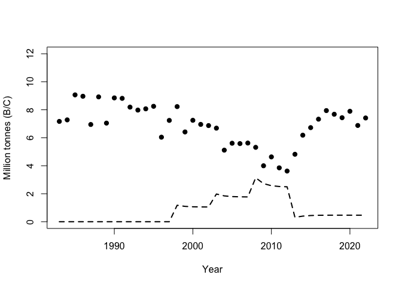
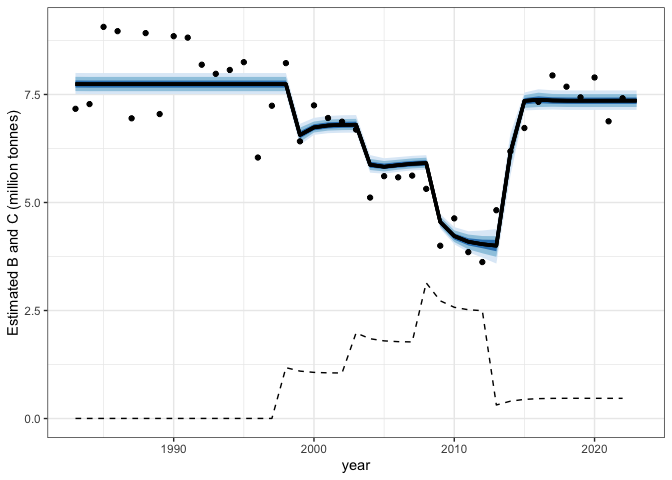
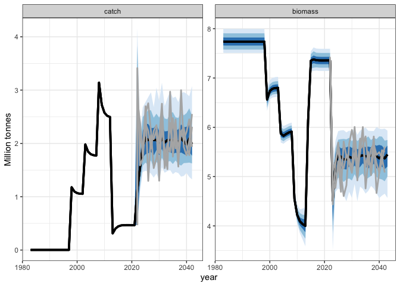

Herring SS Assessment
================
AMiller
January 2022

``` r
library(tidyverse)
```

    ## ── Attaching packages ─────────────────────────────────────── tidyverse 1.3.0 ──

    ## ✓ ggplot2 3.3.5     ✓ purrr   0.3.3
    ## ✓ tibble  3.1.0     ✓ dplyr   1.0.7
    ## ✓ tidyr   1.0.2     ✓ stringr 1.4.0
    ## ✓ readr   1.3.1     ✓ forcats 0.4.0

    ## ── Conflicts ────────────────────────────────────────── tidyverse_conflicts() ──
    ## x dplyr::filter() masks stats::filter()
    ## x dplyr::lag()    masks stats::lag()

``` r
library(ggdist)
library(Hmisc)
```

    ## Loading required package: lattice

    ## Loading required package: survival

    ## Loading required package: Formula

    ## 
    ## Attaching package: 'Hmisc'

    ## The following objects are masked from 'package:dplyr':
    ## 
    ##     src, summarize

    ## The following objects are masked from 'package:base':
    ## 
    ##     format.pval, units

``` r
library(mvtnorm)
library(here)
```

    ## here() starts at /Users/sgaichas/Documents/0_Data/MSE/cinar-mse-projects

#### The Operating Model

The population dynamics for the operating model (the ‘real’ dynamics)
are governed by the equation:  
\[B_{y+1} = B_y + B_y * r * ( 1 - \frac{B_y}{K}) - C_y\] where \(B_y\)
is the biomass in year \(y\), \(C_y\) is the catch in year \(y\), \(r\)
is the population intrinsic growth rate, and \(K\) is the population
carrying capacity.

We assume that the population is at carrying capacity in the first year
of our simulation (i.e. \(B_1=K\)).

Our first task is to condition our operating model, that we will then
use to perform the MSE simulations.

\#\#\#\#\#Input data and associated years

``` r
load(here("multispecies/data/GBdata.rda"))
AtlHerring <- subset(GB.data, Species=="AtlHerring")
data.years <- AtlHerring$Year
harvest <- AtlHerring$TotCatch
index <- AtlHerring$ObsBio
```

We can plot these:

``` r
plot(data.years,index, pch=19,xlab="Year",ylab="Million tonnes (B/C)",
     ylim=c(0,12))
lines(data.years,harvest,lty=2,lwd=2)
```

<!-- -->

Now we will create some functions to use as we develop the operating
model.

First, the logistic production function:

``` r
schaefer <- function(B,C,K,r) {
  #function schaefer takes the current biomass, a catch, 
  #and the model parameters to compute next year's biomass
  res <- B + B * r * (1 - B/K) - C
  return(max(0.001,res))  # we add a constraint to prevent negative biomass
}
```

Now a function to do the biomass projection:

``` r
dynamics <- function(pars,C,yrs) {
  # dynamics takes the model parameters, the time series of catch, 
  # & the yrs to do the projection over
  
  # first extract the parameters from the pars vector (we estimate K in log-space)
  K <- exp(pars[1])
  r <- exp(pars[2])
  
  # find the total number of years
  nyr <- length(C) + 1
  
  # if the vector of years was not supplied we create 
  # a default to stop the program crashing
  if (missing(yrs)) yrs <- 1:nyr
  
  #set up the biomass vector
  B <- numeric(nyr)
  
  #intialize biomass at carrying capacity
  B[1] <- K
  # project the model forward using the schaefer model
  for (y in 2:nyr) {
    B[y] <- schaefer(B[y-1],C[y-1],K,r)
  }
  
  #return the time series of biomass
  return(B[yrs])
  
  #end function dynamics
}  
```

We are going to condition the operating model by estimating the
parameters based on the historical biomass index data.

To do this we make a function that shows how well the current parameters
fit the data, we assume that the observation errors around the true
biomass are log-normally distributed.

``` r
# function to calculate the negative log-likelihood
nll <- function(pars,C,U) {  #this function takes the parameters, the catches, and the index data
  sigma <- exp(pars[3])  # additional parameter, the standard deviation of the observation error
  B <- dynamics(pars,C)  #run the biomass dynamics for this set of parameters
  Uhat <- B   #calculate the predicted biomass index - here we assume an unbiased absolute biomass estimate
  output <- -sum(dnorm(log(U),log(Uhat),sigma,log=TRUE),na.rm=TRUE)   #calculate the negative log-likelihood
  return(output)
  #end function nll
}
```

Function to perform the assessment and estimate the operating model
parameters  
(i.e. to fit the logistic model to abundance data)

``` r
assess <- function(catch,index,calc.vcov=FALSE,pars.init) {
  # assess takes catch and index data, initial values for the parameters,
  # and a flag saying whether to compute uncertainty estimates for the model parameters
  
  #fit model
  # optim runs the function nll() repeatedly with differnt values for the parameters,
  # to find the values that give the best fit to the index data
  res <- optim(pars.init,nll,C=catch,U=index,hessian=TRUE)
  
  # store the output from the model fit
  output <- list()
  output$pars <- res$par
  output$biomass <- dynamics(res$par,catch)
  output$convergence <- res$convergence
  output$nll <- res$value
  if (calc.vcov)
    output$vcov <- solve(res$hessian)
  
  return(output)
  #end function assess
}
```

Now we have written the functions to do the calculations, we can run
them and perform the assessment.

First define initial parameter vector for: log(K), log(r), log(sigma)

``` r
# maxsvB.GBcod <- max(index.GBcod)
# ini.parms.GBcod <- c(log(maxsvB.GBcod), log(0.2), log(0.3))

maxsvB.GBherring <- max(index)
ini.parms.GBherring <- c(log(maxsvB.GBherring), log(0.3), log(0.3))

#maxsvB.GBhaddock <- max(index.GBhaddock)
#ini.parms.GBhaddock <- c(log(maxsvB.GBhaddock), log(0.3), log(0.3))
```

Fit the logistic model to data:

``` r
GBHerring <- assess(harvest,index,calc.vcov=TRUE,ini.parms.GBherring)
GBHerring
```

    ## $pars
    ## [1]  2.0452567  0.2470391 -2.3721717
    ## 
    ## $biomass
    ##  [1] 7.731143 7.728940 7.729494 7.729314 7.729356 7.729341 7.729344 7.729343
    ##  [9] 7.729343 7.729343 7.729343 7.729343 7.729343 7.729343 7.729343 7.729343
    ## [17] 6.554175 6.733990 6.777934 6.790430 6.794363 5.867628 5.831486 5.868671
    ## [25] 5.899521 5.916098 4.554007 4.225116 4.103541 4.050814 4.023411 6.180407
    ## [33] 7.366130 7.368061 7.350684 7.347242 7.346002 7.346277 7.346699 7.346952
    ## [41] 7.347016
    ## 
    ## $convergence
    ## [1] 0
    ## 
    ## $nll
    ## [1] -39.07345
    ## 
    ## $vcov
    ##               [,1]          [,2]          [,3]
    ## [1,]  2.698832e-04 -4.835464e-04 -7.479694e-07
    ## [2,] -4.835464e-04  1.298939e-03  7.440093e-06
    ## [3,] -7.479694e-07  7.440093e-06  1.218977e-02

Extract the maximum likelihood and parameter estimates

``` r
biomass.mle <- GBHerring$biomass
print(biomass.mle)
```

    ##  [1] 7.731143 7.728940 7.729494 7.729314 7.729356 7.729341 7.729344 7.729343
    ##  [9] 7.729343 7.729343 7.729343 7.729343 7.729343 7.729343 7.729343 7.729343
    ## [17] 6.554175 6.733990 6.777934 6.790430 6.794363 5.867628 5.831486 5.868671
    ## [25] 5.899521 5.916098 4.554007 4.225116 4.103541 4.050814 4.023411 6.180407
    ## [33] 7.366130 7.368061 7.350684 7.347242 7.346002 7.346277 7.346699 7.346952
    ## [41] 7.347016

``` r
pars.mle <- GBHerring$pars
print(exp(pars.mle))
```

    ## [1] 7.73114295 1.28022913 0.09327793

``` r
BMSY <- exp(pars.mle[1])/2
Fmsy <- exp(pars.mle[2])/2

BMSY
```

    ## [1] 3.865571

``` r
Fmsy
```

    ## [1] 0.6401146

To obtain a set of plausible alternatives for the parameters of the
operating model, we will use the statistical uncertainty from the
estimation by sampling parameter sets from the estimated
variance-covariance matrix.

``` r
set.seed(4589)

#define the number of iterations for the MSE 
niter <- 200 
#set up a storage matrix for our alternative parameter sets
pars.iter <- matrix(NA,nrow = niter, ncol=3) 
colnames(pars.iter) <- c("log_K","log_r","log_sigma")

# generate the sets of parameter values
for (i in 1:niter) {
  pars.iter[i,] <- mvtnorm::rmvnorm(1, mean = GBHerring$pars,
                       sigma = GBHerring$vcov)
}

# Now generate replicate model outputs
biomass.iter <- data.frame()
for (i in 1:niter) {
  #here we calculate the biomass trajectory for each of the above sampled parameter vectors
  biomass.iter <- rbind(biomass.iter,
                        data.frame(year = seq(min(data.years),
                                              max(data.years)+1),
                                   biomass = dynamics(pars.iter[i,], harvest),
                                   iter = i))
}
head(biomass.iter)
```

    ##   year  biomass iter
    ## 1 1983 7.795118    1
    ## 2 1984 7.792915    1
    ## 3 1985 7.793499    1
    ## 4 1986 7.793303    1
    ## 5 1987 7.793351    1
    ## 6 1988 7.793334    1

We can now plot the estimated biomass time series

``` r
biomass.iter %>% 
  group_by(year) %>% 
  median_qi(biomass, .width = c(.5, .8, .95)) %>%
  ggplot() + 
  geom_lineribbon(aes(x = year, y = biomass, ymin = .lower, ymax = .upper),
                  show.legend = FALSE) +
  scale_fill_brewer() +
  #theme_bw() +
  geom_line(aes(y=harvest,x=year), data = tibble(harvest = harvest, 
               year = data.years),lty=2) +
  geom_point(aes(y=index, x=year), data = data.frame(index=index, 
               year = data.years)) +
  #geom_line(aes(y=biomass,x=year,group=iter,col=iter),data = subset(biomass.iter,iter%in%1:10)) +
      ylab("Estimated B and C (million tonnes)") + 
  theme_bw() +
  guides(scale = "none")
```

<!-- -->

The shaded area indicates the range of the biomass time series, with the
dark line the median.  
(Uncomment the call to geom\_line() to view some indiviudal biomass
trajectories.)

#### Applying the Management Strategy

We have now conditioned our operating model. We will conduct the MSE
loop over a 20 year projection period, with the catches set each year by
repeated estimation of the current biomass and application of a harvest
control rule.

Define the years for the projection:

``` r
proj.years <- 2022:2042
```

##### Data generation

We write a function to generate the observations (new biomass index
values) from the operating model.

``` r
##### Data generation
observe <- function(biomass, sigma) {
  biomass * exp(rnorm(1, -0.5*sigma^2, sigma))
}
```

This function takes the true biomass from the operating model, and
generates the data by adding (lognormally distributed) observation
error.

##### Harvest Control Rule

We first demonstrate the MSE using a fixed target exploitation rate -
the control rule calculates the catch for next year based on a fixed
percentage (10%) of the most recent biomass estimate.

``` r
control.pars <- list()
control.pars$Htarg <- 0.75*Fmsy
control <- function(estimated.biomass, control.pars) {
  control.pars$Htarg
}
```

We assume perfect implementation of the strategy - in that the realized
catch is the same as the TAC.

``` r
implement <- function(TAC,...) {
  TAC
}
```

Evaluation function that projects the operating model forward &
implements the mgmt procudeure at each time step.  
We will first step through this for one iteration to view how things
work.

``` r
# evaluate <- function(pars.iter, biomass.iter,
#                      control.pars, data.years, proj.years,
#                      iterations, ...) {
  # function arguments:
  # pars.iter & biomass.iter, the parameters & historical biomass trajectories of the operating model
  # control.pars, the specifications of the harvest control rule
  
  # set up some indexing values
  iyr <- length(data.years)+1
  pyr <- length(proj.years)
  yrs <- c(data.years, proj.years, max(proj.years)+1)
  
  # set up a data frame to store the results
  res <- data.frame()
  
  # loop over the iterations of the MSE, each iteration conducts a 20 year projection with annual generation of biomass    
  # observations and appliations of the control rule.
  #for(i in 1:iterations) {
  i = 1
  
    #extract the parameters for this iteration
    K.i <- exp(pars.iter[i,1])
    r.i <- exp(pars.iter[i,2])
    sig.i <- exp(pars.iter[i,3])
    
    #set up vectors for time series of interest.
    biomass.i <- c(subset(biomass.iter, iter==i)$biomass, numeric(pyr))
    index.i <- c(index,numeric(pyr))
    catch.i <- c(harvest, numeric(pyr))
    TAC.i <- numeric(pyr)
    
    # loop over the projection period.
    for (y in iyr:(iyr+pyr-1)) {
      #generate the data for the most recent year
      index.i[y] <- observe(biomass.i[y] , sig.i)
      #calculate the TAC based on the harvest control rule
      # note that the control rule ONLY sees the index data, not the operating model biomass.
      TAC.i [y]  <- control(index.i[y], control.pars) * index.i[y]
      #find the realized catch after implementation error
      catch.i[y] <- implement(TAC.i[y])
      
      # update the true biomass of the operating model based on the output of the HCR
      biomass.i[y+1] <- schaefer(biomass.i[y],catch.i[y],K.i,r.i)
      
      #end projection year loop for iteration i  
    }
    
    #store the results for this iteration
    res <- rbind(res, data.frame(year = yrs[-length(yrs)],
                                 value = index.i, type = "index", iter = i),
                 data.frame(year = yrs[-length(yrs)],
                            value = catch.i, type = "catch", iter=i),
                 data.frame(year = yrs, value = biomass.i,
                            type= "biomass", iter=i)) 
    #end loop over iterations
  #}
  head(res)
```

    ##   year    value  type iter
    ## 1 1983 7.168395 index    1
    ## 2 1984 7.277618 index    1
    ## 3 1985 9.064388 index    1
    ## 4 1986 8.965315 index    1
    ## 5 1987 6.948255 index    1
    ## 6 1988 8.920737 index    1

``` r
#  return(res)
#  #end function evaluate()
#}
```

Reloading the full function with lines uncommented (code hidden from
html to save scrolling time), means we can then run this.

Project with fixed 10% exploitation rate of estimated biomass for all
iterations & 20 yrs

``` r
project.fixed <- evaluate(pars.iter, biomass.iter, control.pars, data.years,
                          proj.years, niter)
tail(project.fixed)
```

    ##       year    value    type iter
    ## 36795 2038 4.884853 biomass  200
    ## 36796 2039 4.999084 biomass  200
    ## 36797 2040 4.886744 biomass  200
    ## 36798 2041 4.877247 biomass  200
    ## 36799 2042 4.346464 biomass  200
    ## 36800 2043 4.589632 biomass  200

We can view the trajectories of catch and operating model biomass from
the output.  
We will do this again so write a function to repeat the task easily

``` r
projection.plot <- function(project.results) {
  #Fig2 <- ggplot(data = subset(project.results, type != "index"),
  #             aes(x = year, y = value))
  project.results %>% 
    filter(type %in% c("biomass","catch")) %>% 
    group_by(type, year) %>% 
    median_qi(value, .width = c(.5, .8, .95)) %>%
    ggplot() +  
    geom_lineribbon(aes(x = year, y = value, ymin = .lower, ymax = .upper),
                  show.legend = FALSE) +
    scale_fill_brewer() +
    geom_line(aes(y=value,x=year),data = subset(project.results, type != "index" & iter==1 & year %in% proj.years), lty=1,lwd=1,col=gray(0.7)) +
    geom_line(aes(y=value,x=year),data = subset(project.results, type != "index" & iter==2 & year %in% proj.years), lty=1,lwd=1,col=gray(0.7)) +
    geom_line(aes(y=value,x=year),data = subset(project.results, type != "index" & iter==3 & year %in% proj.years), lty=1,lwd=1,col=gray(0.7)) +
#stat_summary(fun.data = "median_hilow", geom = "smooth", col="black",
#                    fill = gray(0.5), lty = 2, aes=0.1) +
#       stat_summary(fun = median, fun.min = function(x)0, geom="line",
#                    data = subset(project.results, type != "index" &  year %in% data.years), lwd=1) 
    facet_wrap(~type, scale = "free_y") + 
    ylab("Million tonnes") + 
    theme_bw()
      
}
```

Plot the projection:

``` r
projection.plot(project.fixed)
```

<!-- -->

``` r
saveRDS(project.fixed, file = here("multispecies/data/SS_Herring.rds"))
```

## Add more complex HCR

Run HCR scenario 2

``` r
control.pars.psps <- list()

# control.pars.psps$Species <- SS.Fmsy$Species["Haddock"]
# control.pars.psps$H1 <- 0.75*SS.Fmsy$Fmsy #this matches the max F in the other scenario
# control.pars.psps$H2 <- 0.5*SS.Fmsy$Fmsy 
# control.pars.psps$H3 <- 0.1*SS.Fmsy$Fmsy 
# 
# control.pars.psps$B1 <- 2.0*SS.BMSY$BMSY
# control.pars.psps$B2 <- 1.0*SS.BMSY$BMSY
# control.pars.psps$B3 <- 0.5*SS.BMSY$BMSY
# control.pars.psps$B4 <- 0.25*SS.BMSY$BMSY

#control.pars.psps$Species <- SS.Fmsy$Species["Haddock"]
control.pars.psps$H1 <- 0.75*Fmsy #this matches the max F in the other scenario
control.pars.psps$H2 <- 0.5*Fmsy 
control.pars.psps$H3 <- 0.1*Fmsy 

control.pars.psps$B1 <- 2.0*BMSY
control.pars.psps$B2 <- 1.0*BMSY
control.pars.psps$B3 <- 0.5*BMSY
control.pars.psps$B4 <- 0.25*BMSY


#Plateau-slope-plateau-slop HCR  
  control <- function(estimated.biomass, control.pars.psps){ #, Species) {
    
    H1 <- control.pars.psps$H1#[control.pars.psps$Species==Species]
    H2 <- control.pars.psps$H2#[control.pars.psps$Species==Species]
    H3 <- control.pars.psps$H3#[control.pars.psps$Species==Species]
   
    B4 <- control.pars.psps$B4#[control.pars.psps$Species==Species]
    B3 <- control.pars.psps$B3#[control.pars.psps$Species==Species]
    B2 <- control.pars.psps$B2#[control.pars.psps$Species==Species]
    B1 <- control.pars.psps$B1#[control.pars.psps$Species==Species]
    
    harv <- ifelse(estimated.biomass >= B1, H1,
                   ifelse(estimated.biomass < B1 & estimated.biomass >= B2,
                          (H1-H2)/(B1-B2)*(estimated.biomass - B2) + H2,
                          ifelse(estimated.biomass < B2 & estimated.biomass >= B3, H2,
                                 ifelse(estimated.biomass < B3 & estimated.biomass > B4,
                                        (H2-H3)/(B2-B3)*(estimated.biomass - B3) + H3,
                                        ifelse(estimated.biomass <= B4, H3
                                 )))))
    return(harv)
  }
```

Project with PSPS HCR of estimated biomass for all iterations & 20 yrs

``` r
herring_psps <- evaluate.psps(pars.iter, biomass.iter, control.pars.psps, data.years, proj.years, niter)
tail(herring_psps)
```

    ##       year    value    type iter
    ## 36795 2038 5.463082 biomass  200
    ## 36796 2039 5.156238 biomass  200
    ## 36797 2040 5.328473 biomass  200
    ## 36798 2041 5.148800 biomass  200
    ## 36799 2042 5.446293 biomass  200
    ## 36800 2043 4.618085 biomass  200

``` r
projection.plot(herring_psps)
```

<!-- -->
