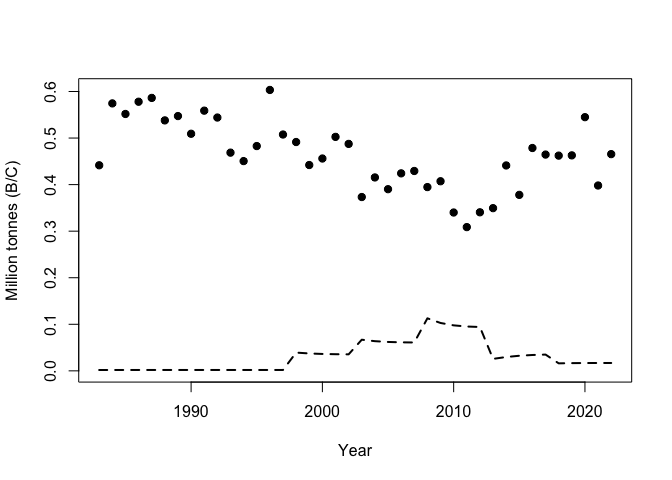
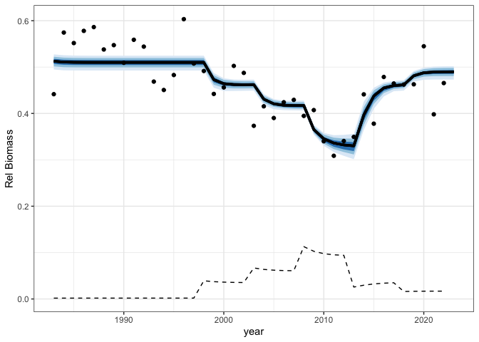
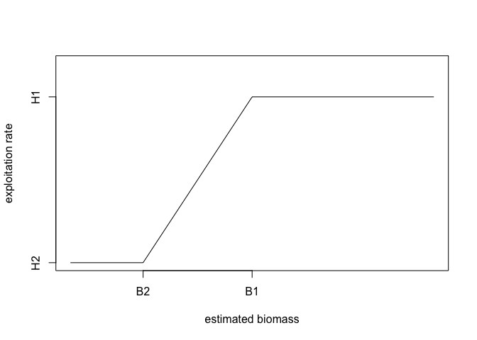
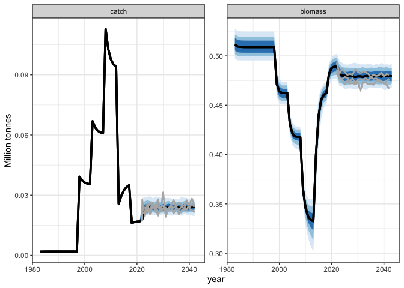
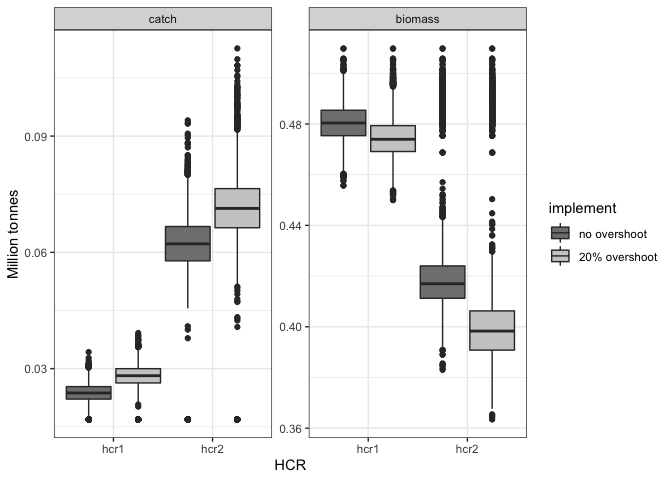
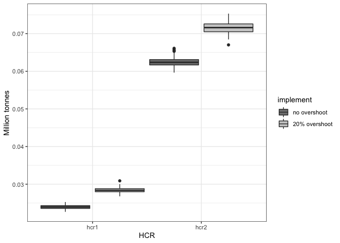
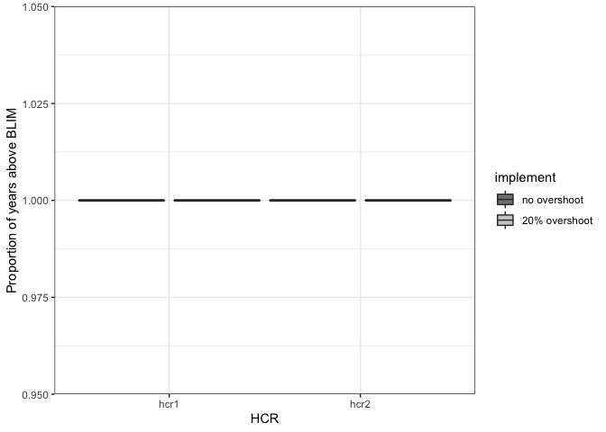

CINAR MSE Workshop: First MSE
================
Team Multispecies
January 2022

### Introduction to MSE cod example

Here we will work through a simple example of applying MSE. Later this
week we will take a more modular approach to implementing MSEs, but we
walk through steps here to give you a flavor for how the pieces work and
can be put together.

This lab is based (heavily) on tutorial by Katell Hamon & Jan-Jaap Poos,
published in Chapter 3 of Edwards & Dankel (eds): *“Management Science
in Fisheries, An introduction to simulation-based methods”*. All errors
below are completely the fault of GF.

We consider a fishery for a population of *Sebastes electronicus*:  
\* the operating model population dynamics are governed by a logistic
(Schaefer) production model.  
\* Data available from the fishery are the catch (known without error),
and a biomass index (e.g. from a survey).  
\* We will apply a simple empirical harvest control rule to demonstrate
the MSE, and use a small set of performance statistics to compare among
alternative versions of the HCR.

There are plenty of places where additional complexity can be built in
to this example. We encourage you to play around with adding
functionality of interest. Some options could include adding a
model-based control rule, changing the dynamics of the operating model,
applying the control rule every 3 years instead of every year, etc.  
\* However, you should be able to walk through this tutorial without
tweaks if you just want to get a feel for how things work.

We assume you have installed `R` on your computer and have an
appropriate text editor or development environment (e.g. `Rstudio`).  
First we install some libraries in `R` that we will use later.  
*(If you do not have these packages installed then see the code on the
landing page of the website to ‘install.packages()’)*

``` r
library(tidyverse)
```

    ## ── Attaching packages ─────────────────────────────────────── tidyverse 1.3.0 ──

    ## ✓ ggplot2 3.3.5     ✓ purrr   0.3.3
    ## ✓ tibble  3.1.0     ✓ dplyr   1.0.7
    ## ✓ tidyr   1.0.2     ✓ stringr 1.4.0
    ## ✓ readr   1.3.1     ✓ forcats 0.4.0

    ## ── Conflicts ────────────────────────────────────────── tidyverse_conflicts() ──
    ## x dplyr::filter() masks stats::filter()
    ## x dplyr::lag()    masks stats::lag()

``` r
library(ggdist)
library(Hmisc)
```

    ## Loading required package: lattice

    ## Loading required package: survival

    ## Loading required package: Formula

    ## 
    ## Attaching package: 'Hmisc'

    ## The following objects are masked from 'package:dplyr':
    ## 
    ##     src, summarize

    ## The following objects are masked from 'package:base':
    ## 
    ##     format.pval, units

``` r
library(mvtnorm)
library(here)
```

    ## here() starts at /Users/sgaichas/Documents/0_Data/MSE/cinar-mse-projects

#### The Operating Model

The population dynamics for the operating model (the ‘real’ dynamics)
are governed by the equation:  
\[B_{y+1} = B_y + B_y * r * ( 1 - \frac{B_y}{K}) - C_y\] where \(B_y\)
is the biomass in year \(y\), \(C_y\) is the catch in year \(y\), \(r\)
is the population intrinsic growth rate, and \(K\) is the population
carrying capacity.

We assume that the population is at carrying capacity in the first year
of our simulation (i.e. \(B_1=K\)).

Our first task is to condition our operating model, that we will then
use to perform the MSE simulations.

\#\#\#\#\#Specify input data and associated years

``` r
data.years <- 1991:2013
harvest <- c(0.1,3,15,52,76,139,95,93,84,93,86,103,104,
             92,46,67,59,30,54,59,47,33,44)
index <- c(NA,NA,NA,NA,NA,NA,NA,NA,935,NA,1057,NA,678,NA,
           420,NA,554,NA,458,NA,474,NA,280)

load(here("multispecies/data/GBdata.rda"))
cod <- subset(GB.data, Species=="Cod")
data.years <- cod$Year
harvest <- cod$TotCatch
index <- cod$ObsBio
```

We create time series of the years, catches (harvest), and biomass index
data for our historical period that are already available.

We can plot these:

``` r
plot(data.years,index, pch=19,xlab="Year",ylab="Million tonnes (B/C)",
     ylim=c(0,max(cod$ObsBio)))
lines(data.years,harvest,lty=2,lwd=2)
```

<!-- -->

We see that the biomass index has been declining.

Now we will create some functions to use as we develop the operating
model.

First, the logistic production function:

``` r
schaefer <- function(B,C,K,r) {
  #function schaefer takes the current biomass, a catch, 
  #and the model parameters to compute next year's biomass
  res <- B + B * r * (1 - B/K) - C
  return(max(0.001,res))  # we add a constraint to prevent negative biomass
}
```

Now a function to do the biomass projection:

``` r
dynamics <- function(pars,C,yrs) {
  # dynamics takes the model parameters, the time series of catch, 
  # & the yrs to do the projection over
  
  # first extract the parameters from the pars vector (we estimate K in log-space)
  K <- exp(pars[1])
  r <- exp(pars[2])
  
  # find the total number of years
  nyr <- length(C) + 1
  
  # if the vector of years was not supplied we create 
  # a default to stop the program crashing
  if (missing(yrs)) yrs <- 1:nyr
  
  #set up the biomass vector
  B <- numeric(nyr)
  
  #intialize biomass at carrying capacity
  B[1] <- K
  # project the model forward using the schaefer model
  for (y in 2:nyr) {
    B[y] <- schaefer(B[y-1],C[y-1],K,r)
  }
  
  #return the time series of biomass
  return(B[yrs])
  
  #end function dynamics
}  
```

We are going to condition the operating model by estimating the
parameters based on the historical biomass index data.

To do this we make a function that shows how well the current parameters
fit the data, we assume that the observation errors around the true
biomass are log-normally distributed.

``` r
# function to calculate the negative log-likelihood
nll <- function(pars,C,U) {  #this function takes the parameters, the catches, and the index data
  sigma <- exp(pars[3])  # additional parameter, the standard deviation of the observation error
  B <- dynamics(pars,C)  #run the biomass dynamics for this set of parameters
  Uhat <- B   #calculate the predicted biomass index - here we assume an unbiased absolute biomass estimate
  output <- -sum(dnorm(log(U),log(Uhat),sigma,log=TRUE),na.rm=TRUE)   #calculate the negative log-likelihood
  return(output)
  #end function nll
}
```

Function to perform the assessment and estimate the operating model
parameters  
(i.e. to fit the logistic model to abundance data)

``` r
assess <- function(catch,index,calc.vcov=FALSE,pars.init) {
  # assess takes catch and index data, initial values for the parameters,
  # and a flag saying whether to compute uncertainty estimates for the model parameters
  
  #fit model
  # optim runs the function nll() repeatedly with differnt values for the parameters,
  # to find the values that give the best fit to the index data
  res <- optim(pars.init,nll,C=catch,U=index,hessian=TRUE)
  
  # store the output from the model fit
  output <- list()
  output$pars <- res$par
  output$biomass <- dynamics(res$par,catch)
  output$convergence <- res$convergence
  output$nll <- res$value
  if (calc.vcov)
    output$vcov <- solve(res$hessian)
  
  return(output)
  #end function assess
}
```

Now we have written the functions to do the calculations, we can run
them and perform the assessment.

First define initial parameter vector for: log(K), log(r), log(sigma)

``` r
ini.parms <- c(-0.6,-0.3 ,-2.1 )
```

Fit the logistic model to data:

``` r
cod <- assess(harvest,index,calc.vcov=TRUE,ini.parms)
cod
```

    ## $pars
    ## [1] -0.6701726 -0.2307355 -2.3779600
    ## 
    ## $biomass
    ##  [1] 0.5116203 0.5098124 0.5093995 0.5092907 0.5092558 0.5092426 0.5092375
    ##  [8] 0.5092361 0.5092364 0.5092375 0.5092390 0.5092404 0.5092418 0.5092430
    ## [15] 0.5092440 0.5092449 0.4719221 0.4636574 0.4618812 0.4618045 0.4620468
    ## [22] 0.4307140 0.4210535 0.4181658 0.4175633 0.4175950 0.3656999 0.3456827
    ## [29] 0.3369991 0.3331050 0.3312088 0.3982323 0.4385931 0.4558851 0.4612620
    ## [36] 0.4623563 0.4816016 0.4874682 0.4889450 0.4892726 0.4893553
    ## 
    ## $convergence
    ## [1] 0
    ## 
    ## $nll
    ## [1] -39.32311
    ## 
    ## $vcov
    ##               [,1]          [,2]          [,3]
    ## [1,]  3.213330e-04 -1.011486e-03 -1.771908e-07
    ## [2,] -1.011486e-03  5.757233e-03 -3.410619e-07
    ## [3,] -1.771908e-07 -3.410619e-07  1.219703e-02

Extract the maximum likelihood and parameter estimates

``` r
biomass.mle <- cod$biomass
print(biomass.mle)
```

    ##  [1] 0.5116203 0.5098124 0.5093995 0.5092907 0.5092558 0.5092426 0.5092375
    ##  [8] 0.5092361 0.5092364 0.5092375 0.5092390 0.5092404 0.5092418 0.5092430
    ## [15] 0.5092440 0.5092449 0.4719221 0.4636574 0.4618812 0.4618045 0.4620468
    ## [22] 0.4307140 0.4210535 0.4181658 0.4175633 0.4175950 0.3656999 0.3456827
    ## [29] 0.3369991 0.3331050 0.3312088 0.3982323 0.4385931 0.4558851 0.4612620
    ## [36] 0.4623563 0.4816016 0.4874682 0.4889450 0.4892726 0.4893553

``` r
pars.mle <- cod$pars
print(exp(pars.mle))
```

    ## [1] 0.51162027 0.79394946 0.09273958

Estimate the reference points

``` r
BMSY <- pars.mle[1]/2
Fmsy <- pars.mle[2]/2
```

To obtain a set of plausible alternatives for the parameters of the
operating model, we will use the statistical uncertainty from the
estimation by sampling parameter sets from the estimated
variance-covariance matrix.

``` r
#define the number of iterations for the MSE 
niter <- 200 
#set up a storage matrix for our alternative parameter sets
pars.iter <- matrix(NA,nrow = niter, ncol=3) 
colnames(pars.iter) <- c("log_K","log_r","log_sigma")

# generate the sets of parameter values
for (i in 1:niter) {
  pars.iter[i,] <- mvtnorm::rmvnorm(1, mean = cod$pars,
                       sigma = cod$vcov)
}

# Now generate replicate model outputs
biomass.iter <- data.frame()
for (i in 1:niter) {
  #here we calculate the biomass trajectory for each of the above sampled parameter vectors
  biomass.iter <- rbind(biomass.iter,
                        data.frame(year = seq(min(data.years),
                                              max(data.years)+1),
                                   biomass = dynamics(pars.iter[i,], harvest),
                                   iter = i))
}
head(biomass.iter)
```

    ##   year   biomass iter
    ## 1 1983 0.5086837    1
    ## 2 1984 0.5068759    1
    ## 3 1985 0.5064191    1
    ## 4 1986 0.5062899    1
    ## 5 1987 0.5062476    1
    ## 6 1988 0.5062318    1

We can now plot the estimated biomass time series

``` r
biomass.iter %>% 
  group_by(year) %>% 
  median_qi(biomass, .width = c(.5, .8, .95)) %>%
  ggplot() + 
  geom_lineribbon(aes(x = year, y = biomass, ymin = .lower, ymax = .upper),
                  show.legend = FALSE) +
  scale_fill_brewer() +
  #theme_bw() +
  geom_line(aes(y=harvest,x=year), data = tibble(harvest = harvest, 
               year = data.years),lty=2) +
  geom_point(aes(y=index, x=year), data = data.frame(index=index, 
               year = data.years)) +
  #geom_line(aes(y=biomass,x=year,group=iter,col=iter),data = subset(biomass.iter,iter%in%1:10)) +
      ylab("Rel Biomass") + 
  theme_bw() +
  guides(scale = "none")
```

<!-- -->

The shaded area indicates the range of the biomass time series, with the
dark line the median.  
(Uncomment the call to geom\_line() to view some indiviudal biomass
trajectories.)

#### Applying the Management Strategy

We have now conditioned our operating model. We will conduct the MSE
loop over a 20 year projection period, with the catches set each year by
repeated estimation of the current biomass and application of a harvest
control rule.

Define the years for the projection:

``` r
proj.years <- 2022:2042
```

##### Data generation

We write a function to generate the observations (new biomass index
values) from the operating model.

``` r
##### Data generation
observe <- function(biomass, sigma) {
  biomass * exp(rnorm(1, -0.5*sigma^2, sigma))
}
```

This function takes the true biomass from the operating model, and
generates the data by adding (lognormally distributed) observation
error.

##### Harvest Control Rule

We first demonstrate the MSE using a fixed target exploitation rate -
the control rule calculates the catch for next year based on a fixed
percentage (75%) of the Fmsy estimate applied to current biomass.

``` r
control.pars <- list()
control.pars$Htarg <- 0.75*Fmsy

control <- function(estimated.biomass, control.pars) {
  control.pars$Htarg
}
```

We assume perfect implementation of the strategy - in that the realized
catch is the same as the TAC.

``` r
implement <- function(TAC,...) {
  TAC
}
```

Evaluation function that projects the operating model forward &
implements the mgmt procudeure at each time step.  
We will first step through this for one iteration to view how things
work.

``` r
# evaluate <- function(pars.iter, biomass.iter,
#                      control.pars, data.years, proj.years,
#                      iterations, ...) {
  # function arguments:
  # pars.iter & biomass.iter, the parameters & historical biomass trajectories of the operating model
  # control.pars, the specifications of the harvest control rule
  
  # set up some indexing values
  iyr <- length(data.years)+1
  pyr <- length(proj.years)
  yrs <- c(data.years, proj.years, max(proj.years)+1)
  
  # set up a data frame to store the results
  res <- data.frame()
  
  # loop over the iterations of the MSE, each iteration conducts a 20 year projection with annual generation of biomass    
  # observations and appliations of the control rule.
  #for(i in 1:iterations) {
  i = 1
  
    #extract the parameters for this iteration
    K.i <- exp(pars.iter[i,1])
    r.i <- exp(pars.iter[i,2])
    sig.i <- exp(pars.iter[i,3])
    
    #set up vectors for time series of interest.
    biomass.i <- c(subset(biomass.iter, iter==i)$biomass, numeric(pyr))
    index.i <- c(index,numeric(pyr))
    catch.i <- c(harvest, numeric(pyr))
    TAC.i <- numeric(pyr)
    
    # loop over the projection period.
    for (y in iyr:(iyr+pyr-1)) {
      #generate the data for the most recent year
      index.i[y] <- observe(biomass.i[y] , sig.i)
      #calculate the TAC based on the harvest control rule
      # note that the control rule ONLY sees the index data, not the operating model biomass.
      TAC.i [y]  <- control(index.i[y], control.pars) * index.i[y]
      #find the realized catch after implementation error
      catch.i[y] <- implement(TAC.i[y])
      
      # update the true biomass of the operating model based on the output of the HCR
      biomass.i[y+1] <- schaefer(biomass.i[y],catch.i[y],K.i,r.i)
      
      #end projection year loop for iteration i  
    }
    
    #store the results for this iteration
    res <- rbind(res, data.frame(year = yrs[-length(yrs)],
                                 value = index.i, type = "index", iter = i),
                 data.frame(year = yrs[-length(yrs)],
                            value = catch.i, type = "catch", iter=i),
                 data.frame(year = yrs, value = biomass.i,
                            type= "biomass", iter=i)) 
    #end loop over iterations
  #}
  head(res)
```

    ##   year     value  type iter
    ## 1 1983 0.4415278 index    1
    ## 2 1984 0.5744308 index    1
    ## 3 1985 0.5517241 index    1
    ## 4 1986 0.5780094 index    1
    ## 5 1987 0.5861980 index    1
    ## 6 1988 0.5379235 index    1

``` r
#  return(res)
#  #end function evaluate()
#}
```

Reloading the full function with lines uncommented (code hidden from
html to save scrolling time), means we can then run this.

Project with fixed 75%Fmsy of estimated biomass for all iterations & 20
yrs

``` r
project.fixed <- evaluate(pars.iter, biomass.iter, control.pars, data.years,
                          proj.years, niter)
tail(project.fixed)
```

    ##       year     value    type iter
    ## 36795 2038 0.5816132 biomass  200
    ## 36796 2039 0.5882848 biomass  200
    ## 36797 2040 0.5766320 biomass  200
    ## 36798 2041 0.5912555 biomass  200
    ## 36799 2042 0.5769966 biomass  200
    ## 36800 2043 0.5757080 biomass  200

We can view the trajectories of catch and operating model biomass from
the output.  
We will do this again so write a function to repeat the task easily

``` r
projection.plot <- function(project.results) {
  #Fig2 <- ggplot(data = subset(project.results, type != "index"),
  #             aes(x = year, y = value))
  project.results %>% 
    filter(type %in% c("biomass","catch")) %>% 
    group_by(type, year) %>% 
    median_qi(value, .width = c(.5, .8, .95)) %>%
    ggplot() +  
    geom_lineribbon(aes(x = year, y = value, ymin = .lower, ymax = .upper),
                  show.legend = FALSE) +
    scale_fill_brewer() +
    geom_line(aes(y=value,x=year),data = subset(project.results, type != "index" & iter==1 & year %in% proj.years), lty=1,lwd=1,col=gray(0.7)) +
    geom_line(aes(y=value,x=year),data = subset(project.results, type != "index" & iter==2 & year %in% proj.years), lty=1,lwd=1,col=gray(0.7)) +
    geom_line(aes(y=value,x=year),data = subset(project.results, type != "index" & iter==3 & year %in% proj.years), lty=1,lwd=1,col=gray(0.7)) +
#stat_summary(fun.data = "median_hilow", geom = "smooth", col="black",
#                    fill = gray(0.5), lty = 2, aes=0.1) +
#       stat_summary(fun = median, fun.min = function(x)0, geom="line",
#                    data = subset(project.results, type != "index" &  year %in% data.years), lwd=1) 
    facet_wrap(~type, scale = "free_y") + 
    ylab("Million tonnes") + 
    theme_bw()
      
}
```

Plot the projection:

``` r
projection.plot(project.fixed)
```

<!-- -->

``` r
saveRDS(project.fixed, file = here("multispecies/data/SS_Cod.rds"))
```

## UNCHANGED BELOW HERE aside from Rpath cod data

#### Management using alternative harvest control rules

Define a HCR that converts estimated biomass into a harvest rate using a
functional form determined by values in ‘control.pars’.

``` r
control <- function(estimated.biomass, control.pars) {
  H1 <- control.pars$H1
  H2 <- control.pars$H2
  Bmax <- control.pars$Bmax
  B2 <- control.pars$B2
  B1 <- control.pars$B1
  
  harv <- ifelse(estimated.biomass >= B1, H1,
                 ifelse(estimated.biomass < B2, H2,
                        (H1-H2)/(B1-B2)*(estimated.biomass - B2) + H2))
  
  return(harv)
  
  #end function control
}
```

Define control parameters for HCR using reference points  
We (arbitrarily) set the threshold and limit biomass reference points as
50% & 20% of the maximum observed survey index value during the
historical period.  
The target exploitation rate is set at 5%.

``` r
control.pars <- list()
control.pars$H1 <- 0.05
control.pars$H2 <- 0
control.pars$Bmax <- max(index, na.rm =TRUE)
control.pars$B2 <- 0.2*control.pars$Bmax
control.pars$B1 <- 0.5*control.pars$Bmax
```

Plot the HCR shape:

``` r
plot(c(0,control.pars$B2,control.pars$B1,control.pars$Bmax),
     c(control.pars$H2,control.pars$H2,control.pars$H1,control.pars$H1),
     type='l',axes=F,xlab="estimated biomass",ylab="exploitation rate",
     ylim=c(0,1.2*control.pars$H1))
axis(1,at=c(control.pars$B2,control.pars$B1),labels=c("B2","B1"))
axis(2,at=c(control.pars$H2,control.pars$H1),labels=c("H2","H1"))
box()
```

<!-- -->

Conduct the evaluation by projecting system forward in time

``` r
project.hcr <- evaluate(pars.iter, biomass.iter, control.pars,
                        data.years, proj.years, niter)
```

Plot the trajectories:

``` r
projection.plot(project.hcr)
```

<!-- -->

Now let’s add potential for overshooting the TAC

``` r
implement <- function(TAC, overshoot, ...) {
  TAC * (1 + overshoot)
}
```

#### Comparing different HCRs & accounting for possible TAC overshoot

Set the HCR parameters

``` r
control.pars <- list()
control.pars$H1 <- 0.05
control.pars$H2 <- 0
control.pars$Bmax <- max(index, na.rm =TRUE)
control.pars$B2 <- 0.2*control.pars$Bmax
control.pars$B1 <- 0.5*control.pars$Bmax
```

Conduct the base scenario (no TAC overshoot)

``` r
proj.hcr1.noerror <- evaluate(pars.iter, biomass.iter,
                          control.pars, data.years,
                          proj.years, niter,
                          overshoot = 0)
```

Now run the HCR with 20% overshoot in TAC

``` r
proj.hcr1.error <- evaluate(pars.iter, biomass.iter,
                              control.pars, data.years,
                              proj.years, niter,
                              overshoot = 0.2)
```

We will further do two more HCRs where we increase the target harvest
rate:

``` r
control.pars$H1 <- 0.15
```

Run both scenarios with this new target harvest rate

``` r
proj.hcr2.noerror <- evaluate(pars.iter, biomass.iter,
                              control.pars, data.years,
                              proj.years, niter,
                              overshoot = 0)
proj.hcr2.error <- evaluate(pars.iter, biomass.iter,
                            control.pars, data.years,
                            proj.years, niter,
                            overshoot = 0.2)
```

#### Diagnostics

We have run the evaluations for 4 HCRs. We can now compare these.  
Create an object containing all the results:

``` r
MSE <- rbind(cbind(proj.hcr1.noerror, HCR="hcr1",
                   implement = "no overshoot"),
             cbind(proj.hcr1.error, HCR="hcr1",
                   implement = "20% overshoot"),
             cbind(proj.hcr2.noerror, HCR="hcr2",
                   implement = "no overshoot"),
             cbind(proj.hcr2.error, HCR="hcr2",
                   implement = "20% overshoot"))
head(MSE)
```

    ##   year     value  type iter  HCR    implement
    ## 1 1983 0.4415278 index    1 hcr1 no overshoot
    ## 2 1984 0.5744308 index    1 hcr1 no overshoot
    ## 3 1985 0.5517241 index    1 hcr1 no overshoot
    ## 4 1986 0.5780094 index    1 hcr1 no overshoot
    ## 5 1987 0.5861980 index    1 hcr1 no overshoot
    ## 6 1988 0.5379235 index    1 hcr1 no overshoot

Summarize biomass & catch for all 4 options:

``` r
Fig5 <- ggplot(data=subset(MSE, type !="index" &
                          year %in% proj.years), 
               aes(x=HCR, y=value, ymin=0))
Fig5 + geom_boxplot(aes(fill=implement), width = 1) + facet_wrap(~type, scale="free_y") + ylab("Million tonnes") + scale_fill_grey(start=0.5) + theme_bw()
```

<!-- --> We
immediately see a yield-biomass tradeoff - HCR2 gives more catch but
leads to lower biomass. There is not much change when the catch is 20%
higher than the TAC.

#### Performance statistics

``` r
#Yield based metrics  (e.g. average annual catch)
#Stock Biomass metrics (e.g. distribution for B/BMSY, P(B>BLIM), etc.)
#Inter-annual stability of catch advice (e.g. how often the control rule closes the fishery)

aac2 <- with(MSE[MSE$year>max(data.years) & MSE$type=="catch",],
            aggregate(value,by=list(iter=iter,HCR=HCR,implement=implement),FUN=mean,na.rm=TRUE))


Fig6 <- ggplot(data=subset(aac2), 
               aes(x=HCR, y=x, ymin=0))
Fig6 + geom_boxplot(aes(fill=implement), width = 1)  + ylab("Million tonnes") + scale_fill_grey(start=0.5) + theme_bw()
```

<!-- -->

``` r
# years B > BLIM
# BLIM = 0.25*K  (we specify BLIM for our performance as half BMSY)
blim <- 0.25*exp(pars.iter[,1])

num.above <- function(vec,threshold) {
 length(vec[vec>threshold])/length(vec)
}
MSE$blim <- blim[MSE$iter]
MSE$above.blim <- ifelse(MSE$value>MSE$blim,1,0)

above.blim <- with(MSE[MSE$year>max(data.years) & MSE$type=="biomass",],
            aggregate(above.blim,by=list(iter=iter,HCR=HCR,implement=implement),FUN=sum,na.rm=TRUE))
above.blim$x <- above.blim$x/length(proj.years)

Fig7 <- ggplot(data=subset(above.blim), 
               aes(x=HCR, y=x, ymin=0))
Fig7 + geom_boxplot(aes(fill=implement), width = 1)  + ylab("Proportion of years above BLIM") + scale_fill_grey(start=0.5) + theme_bw()
```

<!-- -->

``` r
# num years fishery is open
not.closed <- with(MSE[MSE$year>max(data.years) & MSE$type=="catch",],
             aggregate(value,by=list(iter=iter,HCR=HCR,implement=implement),FUN=num.above,threshold=0))

Fig8 <- ggplot(data=subset(not.closed), 
               aes(x=HCR, y=x, ymin=0))
Fig8 + geom_boxplot(aes(fill=implement), width = 1)  + ylab("Proportion of years TAC > 0") + scale_fill_grey(start=0.5) + theme_bw()
```

<!-- -->

### Next Steps

Your turn to add features\!

Suggestions:  
1\. Produce a trade-off plot (hint: perhaps think about some alternative
performance statistics that integrate across iterations)  
2\. Add a model-based control rule by performing a stock assessment
(e.g. production model) each year in the projection period. Then use the
catch associated with the estimated FMSY as the TAC. Be careful not to
give the assessment model the true parameter values from the operating
model.  
3\. Implement the HCR every 3 yrs rather than every 1.  
4\. Add a more complicated implementation function (say based on
price?)  
5\. Add environmental variability (process error) into the population
dynamics
