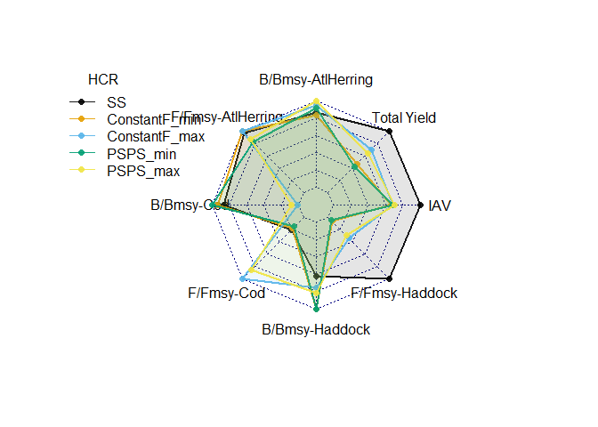

Summary outputs
================
Sean Lucey
1/13/2022

## Multispecies MSE

We ran both single species and multispecies models to compare and
contrast. Single species assessments were conducted using a simple
Schaefer surplus-production model as the operating model while the
multispecies assessments were conducted using Rpath. Single species
models were run 200 times to address parameter uncertainty. There is a
process to do something similar in Rpath but there was not enough time
during this workshop to implement it. Therefore, interation \#10 was
chosen at random to represent the single species run and simplify
output.

### Load data

``` r
#Single species
ss.cod <- as.data.table(readRDS(file = here('multispecies', 'data', 'SS_Cod.rds')))
ss.cod <- ss.cod[iter == 15, ]
ss.cod[, Species := 'Cod']

ss.had <- as.data.table(readRDS(file = here('multispecies', 'data', 'SS_Haddock.rds')))
ss.had <- ss.had[iter == 10, ]
ss.had[, Species := 'Haddock']

ss.her <- as.data.table(readRDS(file = here('multispecies', 'data', 'SS_Herring.rds')))
ss.her <- ss.her[iter == 10, ]
ss.her[, Species := 'AtlHerring']

ss <- rbindlist(list(ss.cod, ss.had, ss.her))

#Reorder columns to match MS output
ss <- ss[, list(year, Species, value, type)]
ss[, HCR := 'SS']
setnames(ss, 'year', 'Year')

#Multispecies
ms.constantF <- as.data.table(readRDS(file = here('multispecies', 'data', 'MS_ConstantF.rds')))
ms.psps <- as.data.table(readRDS(file = here('multispecies', 'data', 'MS_PSPS.rds')))

all.data <- rbindlist(list(ss, ms.constantF, ms.psps))

#Reference points
Bmsy <- readRDS(here('multispecies', 'data', 'BMSY.rds'))
Fmsy <- readRDS(here('multispecies', 'data', 'Fmsy.rds'))
```

### Calculate summary statistics

We’ll average over the last 5 years of the simulation and see where
things stack up compared to the reference points. Also look at average
yield and interannual variation in catch.

\[IAV = \frac{\sqrt{(1/n - 1)\sum_{y=1}^{n-1}(C_{y+1} - C_y)^2}}{1/n\sum_{y=1}^nC_y}\]
where \(n\) is the number of years (\(y\)) in the simulation and \(C_y\)
the recommended catch summed over all species for the given year

``` r
# Interannual variation
iav <- function(catch){
  catch <- data.table(catch = catch)
  n <- nrow(catch)
  catch[, catch1 := shift(catch, type = 'lead')]
  catch[, var := (catch1 - catch)^2]
  output <- sqrt((1/(n - 1))*sum(catch[, var], na.rm = T)) / ((1/n)*sum(catch[, catch]))
}
```

Calculate the ratio of reference points to their references

``` r
#Mean biomass and catch for the last 5 years of projections
mean.end <- all.data[Year %in% 2038:2042, mean(value), by = c('Species', 'type', 'HCR')]

#Need to convert catch to F by dividing C by B
F.end <- merge(mean.end[type == 'biomass', ], mean.end[type == 'catch', ], 
               by = c('Species', 'HCR'))
F.end[, V1 := V1.y / V1.x]
F.end[, type := 'Fmort']
F.end <- F.end[, list(Species, type, HCR, V1)]

end.val <- rbindlist(list(mean.end[type == 'biomass'], F.end))

#Calculate reference point ratios
ref.points <- merge(end.val,    Bmsy, by = 'Species')
ref.points <- merge(ref.points, Fmsy, by = 'Species')

ref.points[type == 'biomass', value := V1 / BMSY]
ref.points[type == 'Fmort',   value := V1 / Fmsy]

ref.points[type == 'biomass', metric := paste0('B/Bmsy-', Species)]
ref.points[type == 'Fmort',   metric := paste0('F/Fmsy-', Species)]

ref.points[, c('Species', 'type', 'V1', 'BMSY', 'Fmsy') := NULL]
```

Calculate interannual variance

``` r
all.catch <- all.data[type == 'catch', sum(value), by = c('Year', 'HCR')]
iav.out <- all.catch[, iav(V1), by = 'HCR']
iav.out[, metric := 'IAV']
setnames(iav.out, 'V1', 'value')
```

Grab total yield from the system

``` r
yield <- mean.end[type == 'catch', sum(V1), by = 'HCR']
yield[, metric := 'Total Yield']
setnames(yield, 'V1', 'value')
```

### Plot output

Using code from Gavin to plot in a radar plot

``` r
do_radar_plot <- function(metrics) {
  # metrics is a dataframe of metrics, expecting columns
  # metrics <- tibble(metric = rep(letters[1:5],each=3),
  #                   value = runif(15),
  #                   mp = as.character(rep(1:3,5)))
  # # metric 
  # # value
  # # mp (management procedure)
  summaries <- metrics %>% 
    group_by(metric) %>% 
    summarize(min = min(value, na.rm = TRUE),
              max = max(value, na.rm = TRUE)) %>% 
    #pivot_longer(cols = c(2:3),names_to = "mp",
    #             values_to = "value") %>% 
    #pivot_wider(names_from = metric, values_from = value) %>% 
    #arrange(desc(mp)) %>% 
    I()
  #summaries  
  nmetrics <- length(unique(metrics$metric))
  nmp <- length(unique(metrics$mp))
    
  d <- metrics %>% 
    group_by(mp) %>% 
    left_join(summaries) %>% 
    mutate(value = value/(max + 0.001)) %>% 
    select(mp, metric, value) %>% 
    pivot_wider(names_from = metric, values_from = value) %>% 
    ungroup()
  
  bounds <- tibble(mp = c("max","min"),
                   'B/Bmsy-Cod' = c(1,0),
                   'B/Bmsy-Haddock' = c(1,0),
                   'B/Bmsy-AtlHerring' = c(1,0),
                   'F/Fmsy-Cod' = c(1,0),
                   'F/Fmsy-Haddock' = c(1,0),
                   'F/Fmsy-AtlHerring' = c(1,0),
                   'IAV' = c(1,0),
                   'Total Yield' = c(1,0))
  
  dd <- bounds %>% 
    bind_rows(d)

#NEW PLOT
#colorblind colors
colors_fill2<-c(alpha("#000000",0.1),
                alpha("#E69F00",0.1),
                alpha("#56B4E9",0.1),
                alpha("#009E73",0.1),
                alpha("#F0E442",0.1),
                alpha("#E69F00",0.1),
                alpha("#56B4E9",0.1),
                alpha("#009E73",0.1))
colors_line2<-c(alpha("#000000",0.9),
                alpha("#E69F00",0.9),
                alpha("#56B4E9",0.9),
                alpha("#009E73",0.9),
                alpha("#F0E442",0.9),
                alpha("#E69F00",0.9),
                alpha("#56B4E9",0.9),
                alpha("#009E73",0.9))

#colorblind
radarchart(dd[,-1],seg=5,pcol=colors_line2,
           pfcol=colors_fill2,plwd=2,
           vlabels=unique(metrics$metric), vlcex=1,
           plty=c(rep(1,nmetrics),rep(2,nmetrics)))
rows<<-rownames(dd[-c(1,2),])
colors_line<<-colors_line2
legend("topleft",inset=-.01,title ="HCR",title.adj = 0.2,
       legend=unique(d$mp),
       pch=16,
       col=colors_line2[1:nmp],
       lty=1, cex=1, bty= 'n', y.intersp=1)

}
```

``` r
metrics <- rbindlist(list(ref.points, iav.out, yield))
metrics[, mp := HCR]

do_radar_plot(metrics)
```

    ## `summarise()` ungrouping output (override with `.groups` argument)

    ## Joining, by = "metric"

<!-- -->
